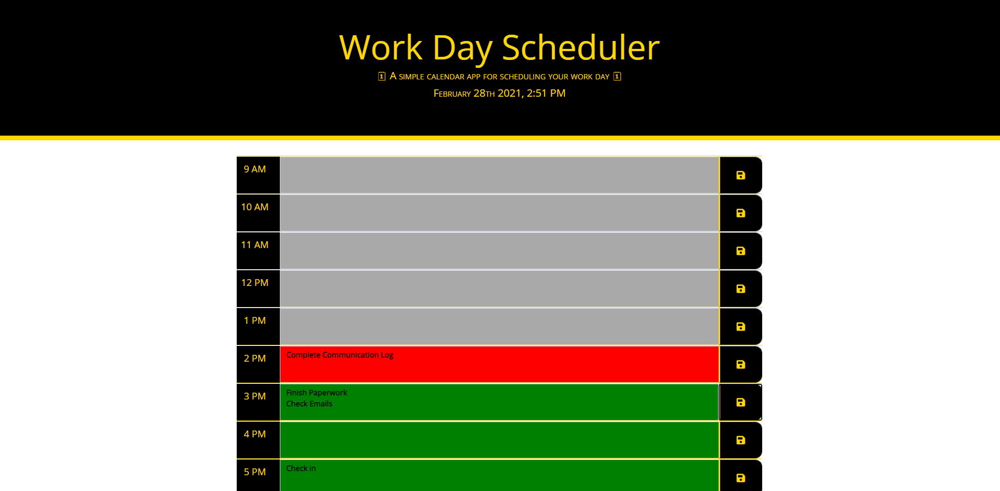

# Work Day Scheduler

## About

 This is a simple scheduling web app meant to track tasks that you need to complete throughout your day. It has rows for each hour in a typical workday. The user can then enter tasks that they need to complete and save them into that field, the web app will save these in each field. The fields are coded by color to let the user know if the task is past due, in the current hour, or still have time to complete the task. The time and date are displayed at the top of the page below the title for easy reference.  
 
 The code for this project consists of HTML, CSS, and Javascript. The Javascript used takes advantage of popular Third-Party API's:
 Link To [bootstrap](https://getbootstrap.com/)
 Link To [fontawesome](https://fontawesome.com/)
 Link To [google fonts](https://fonts.google.com/)
 Link To [jQuery](https://jquery.com/)
 Link To [moment.js](https://momentjs.com/)
 These helped create a responsive yet basic layout for the scheduler and cuts down on the amount of code that we had to use. This is especially true for the time functions and being able to create HTML elements within the Javascript and style them as well. 
 
 ###Screenshot of Workday Scheduler

 